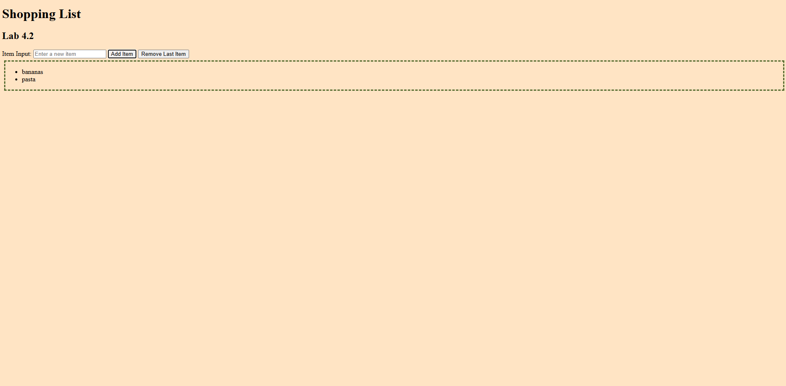

# Shopping List Challenge

This is a solution to an academic assignment to build a simple shopping list to practice Array Manipulation and DOM Manipulation utilizing JavaScript and HTML.

## Table of Contents

- [Overview] (#overview)
 - [Screenshot] (#screenshot)
 - [Features] (#features)
 - [Built-with] (#built-with)
- [Author](#author)

## Overview

### Screenshot

### Features

- Add Item button adds item to shopping list only if it is not already on the list
- Remove last item removes the last added item from the shopping list
- Dynamic list that updates immediately to reflect changes

### Built with

- HTML5
- JavaScript
- CSS custom properties

## Author

- Website - [Stephanye Blakely](https://www.stephanyeblakely.com)
- LinkedIn - [Stephanye-Blakely](https://www.linkedIn.com/in/stephanye-blakely)